# Ocean LK Holdings - Software Requirements Specification (SRS)
## Corporate Website & Management System

---

**Document Version:** 1.0  
**Date:** January 27, 2026  
**Prepared For:** Chief Executive Officer  
**Project:** Ocean LK Holdings Corporate Digital Platform

---

## Table of Contents
1. [Executive Summary](#1-executive-summary)
2. [System Overview](#2-system-overview)
3. [User Roles & Permissions](#3-user-roles--permissions)
4. [Public Website Features](#4-public-website-features)
5. [Admin Panel Features](#5-admin-panel-features)
6. [Super Admin Features](#6-super-admin-features)
7. [Functional Requirements](#7-functional-requirements)
8. [Non-Functional Requirements](#8-non-functional-requirements)
9. [Security Requirements](#9-security-requirements)
10. [System Diagrams](#10-system-diagrams)
11. [Page-by-Page Breakdown](#11-page-by-page-breakdown)
12. [Glossary of Terms](#12-glossary-of-terms)

---

## 1. Executive Summary

### What is this system?
The Ocean LK Holdings Digital Platform is a comprehensive **corporate website** combined with a powerful **content management system (CMS)**. It allows your company to:

- **Showcase** your group of companies, leadership team, and achievements to the world
- **Attract talent** through a modern careers portal with job listings and talent pool collection
- **Communicate** with stakeholders through news, blogs, and media galleries
- **Manage content** securely with role-based access and approval workflows
- **Track engagement** through contact message management and analytics

### Key Business Benefits
| Benefit | Description |
|---------|-------------|
| 🌍 **Global Reach** | Website supports 13 languages including English, Arabic, Chinese, Hindi, and more |
| 🔒 **Enterprise Security** | Industry-standard JWT authentication with encrypted passwords |
| ✅ **Quality Control** | All content changes require Super Admin approval before going live |
| 📊 **Complete Audit Trail** | Every action is logged for compliance and accountability |
| 📱 **Modern Experience** | Responsive design works on phones, tablets, and computers |

---

## 2. System Overview

### 2.1 What the System Does

```mermaid
graph TB
    subgraph "Who Uses It"
        V[🌐 Website Visitors]
        A[👤 Admin Users]
        SA[👑 Super Admin]
    end
    
    subgraph "Ocean LK Platform"
        PW[📄 Public Website]
        AP[⚙️ Admin Panel]
        API[🔌 Backend Server]
        DB[(🗄️ Database)]
    end
    
    V -->|Views| PW
    A -->|Manages Content| AP
    SA -->|Approves & Controls| AP
    PW --> API
    AP --> API
    API --> DB
```

### 2.2 Technical Architecture (Simplified)

| Layer | Technology | Purpose |
|-------|------------|---------|
| **Frontend** | React.js | What users see and interact with |
| **Backend** | Java Spring Boot | Processes requests and business logic |
| **Database** | MongoDB | Stores all content, users, and data |
| **Security** | JWT + BCrypt | Protects login and encrypts passwords |

### 2.3 Data Storage at a Glance

The system manages **16 types of data**:

| Category | Data Types |
|----------|------------|
| **Users & Access** | Admin Users, Audit Logs |
| **Corporate Info** | Companies, Corporate Leaders, Global Metrics |
| **Careers** | Job Opportunities, Talent Pool Applications |
| **Content** | Media Items (News/Blogs/Videos), Events, Testimonials |
| **Communications** | Contact Messages, Partners |
| **Workflow** | Pending Changes (approval queue) |

---

## 3. User Roles & Permissions

### 3.1 User Hierarchy

```mermaid
graph TD
    subgraph "Access Levels"
        SA[👑 Super Admin<br/>Full Control]
        A[👤 Admin<br/>Content Management]
        V[🌐 Visitor<br/>View Only]
    end
    
    SA -->|Creates & Manages| A
    SA -->|Approves Changes From| A
    A -->|Publishes Content For| V
    V -->|Can Become| A
```

### 3.2 Permission Matrix

| Action | Visitor | Admin | Super Admin |
|--------|:-------:|:-----:|:-----------:|
| View public website | ✅ | ✅ | ✅ |
| Submit contact form | ✅ | ✅ | ✅ |
| Apply for jobs | ✅ | ✅ | ✅ |
| Login to admin panel | ❌ | ✅ | ✅ |
| Create/Edit content | ❌ | ✅* | ✅ |
| Approve content changes | ❌ | ❌ | ✅ |
| Manage other admins | ❌ | ❌ | ✅ |
| View audit logs | ❌ | ❌ | ✅ |
| Delete data | ❌ | ✅* | ✅ |

> *Admin changes require Super Admin approval before becoming visible on the public website

### 3.3 Maker-Checker Workflow

This system implements a **"Maker-Checker"** control — a best practice in enterprise systems:

```mermaid
sequenceDiagram
    participant Admin as 👤 Admin (Maker)
    participant System as 🖥️ System
    participant SuperAdmin as 👑 Super Admin (Checker)
    participant Website as 🌐 Public Website
    
    Admin->>System: Creates/Edits content
    System->>System: Saves as "Pending Change"
    System->>SuperAdmin: Notification: Review needed
    SuperAdmin->>System: Reviews change
    alt Approved
        SuperAdmin->>System: Approves
        System->>Website: Content goes live
    else Rejected
        SuperAdmin->>System: Rejects with comments
        System->>Admin: Notification with feedback
    end
```

---

## 4. Public Website Features

### 4.1 Home Page
The landing page showcases Ocean LK Holdings with:
- **Hero Section** — Stunning video background with company tagline
- **Global Metrics** — Display of key statistics (employees, revenue, countries, etc.)
- **Company Portfolio** — Interactive cards for each subsidiary company
- **Sustainability Section** — ESG and environmental initiatives
- **Latest Updates** — Recent news, blogs, and events
- **Testimonials** — Client and partner feedback
- **Partners & Memberships** — Logos of partner organizations

### 4.2 Corporate Section

| Page | Purpose |
|------|---------|
| **Corporate Profile** | Company history, mission, vision, values |
| **Leadership** | Board of Directors, Executive Team, Senior Management with photos and bios |

### 4.3 Companies Section

| Page | Purpose |
|------|---------|
| **Companies List** | Grid view of all subsidiary companies with logos and descriptions |
| **Company Detail** | Full profile of each company including stats, videos, and contact |

### 4.4 Careers Section

| Page | Purpose |
|------|---------|
| **Culture** | Company culture, employee events, life at Ocean LK (videos & photos) |
| **Job Opportunities** | Searchable list of open positions with filters |
| **Job Application** | Detailed job view with online application form |
| **Talent Pool** | General application for future opportunities with CV upload |

### 4.5 News & Media Section

| Page | Purpose |
|------|---------|
| **News Articles** | Press releases and company news |
| **Blog** | Thought leadership and industry insights |
| **Media Gallery** | Photos, videos, and downloadable documents |

### 4.6 Contact Page
- Interactive contact form
- Company headquarters information
- Phone, email, and social media links

---

## 5. Admin Panel Features

### 5.1 Dashboard
The admin dashboard provides at-a-glance metrics:
- Total jobs posted
- Media items count
- Recent applications
- Unread contact messages
- Quick action buttons

### 5.2 Content Management Areas

| Section | What Admin Can Manage |
|---------|----------------------|
| **Companies** | Add, edit, or remove subsidiary company profiles |
| **Media Center** | News articles, blog posts, photo galleries, videos |
| **HR & Careers** | Job listings, events, testimonials, culture media |
| **Website Content** | Leadership profiles, statistics, partners, page content |
| **Messages** | View and respond to contact form submissions |
| **Applications** | Review talent pool and job applications |

### 5.3 My Pending Changes
- View all content changes awaiting Super Admin approval
- See status: Pending, Approved, or Rejected
- Read rejection feedback and make corrections

### 5.4 Profile Management
- Update personal information
- Change password (with OTP verification)
- Update email/phone (requires verification)

---

## 6. Super Admin Features

Super Admins have all Admin capabilities **plus**:

### 6.1 Admin Management
- **Create new Admin accounts** with username, password, email
- **Activate/Deactivate** admin accounts
- **Delete** admin accounts
- View all admins list with their status

### 6.2 Pending Changes Approval
- See all pending changes from all admins
- **Compare** original vs proposed changes
- **Approve** to make changes live
- **Reject** with feedback comments

### 6.3 Audit Logs
- Complete history of all system actions
- Filter by date, user, or action type
- Tracks: Logins, Creates, Updates, Deletes, Approvals

---

## 7. Functional Requirements

### 7.1 Authentication & Access

| ID | Requirement | Priority |
|----|-------------|----------|
| FR-1.1 | System shall require username/password login for admin access | High |
| FR-1.2 | Passwords shall be encrypted before storage | High |
| FR-1.3 | Sessions shall expire after inactivity | High |
| FR-1.4 | OTP verification for password reset | High |
| FR-1.5 | OTP verification for email/phone changes | Medium |

### 7.2 Content Management

| ID | Requirement | Priority |
|----|-------------|----------|
| FR-2.1 | Admin can create, edit, delete news articles | High |
| FR-2.2 | Admin can upload images and videos | High |
| FR-2.3 | All content changes require Super Admin approval | High |
| FR-2.4 | System supports rich text editing | Medium |
| FR-2.5 | Content can be saved as draft or published | Medium |

### 7.3 Careers & Recruitment

| ID | Requirement | Priority |
|----|-------------|----------|
| FR-3.1 | Visitors can view all active job listings | High |
| FR-3.2 | Visitors can apply with CV upload (PDF/DOC) | High |
| FR-3.3 | Visitors can submit to talent pool | High |
| FR-3.4 | Admin can track application status | High |
| FR-3.5 | System stores CVs securely | High |

### 7.4 Communication

| ID | Requirement | Priority |
|----|-------------|----------|
| FR-4.1 | Contact form captures name, email, phone, subject, message | High |
| FR-4.2 | Messages marked as read/unread/archived | Medium |
| FR-4.3 | System tracks message submission date | Low |

### 7.5 Multi-Language Support

| ID | Requirement | Priority |
|----|-------------|----------|
| FR-5.1 | Website supports 13 languages | High |
| FR-5.2 | Users can switch language from any page | High |
| FR-5.3 | Language preference persists across sessions | Medium |

**Supported Languages:**
Arabic, Chinese, Dutch, English, French, German, Greek, Hindi, Italian, Portuguese, Russian, Sinhala, Spanish

---

## 8. Non-Functional Requirements

### 8.1 Performance

| ID | Requirement | Target |
|----|-------------|--------|
| NFR-1.1 | Page load time | < 3 seconds |
| NFR-1.2 | API response time | < 500ms |
| NFR-1.3 | Support concurrent users | 1000+ |

### 8.2 Availability & Reliability

| ID | Requirement | Target |
|----|-------------|--------|
| NFR-2.1 | System uptime | 99.5% |
| NFR-2.2 | Database backup | Daily |
| NFR-2.3 | Disaster recovery | < 4 hours |

### 8.3 Usability

| ID | Requirement |
|----|-------------|
| NFR-3.1 | Responsive design for mobile, tablet, and desktop |
| NFR-3.2 | Consistent navigation across all pages |
| NFR-3.3 | Clear error messages for user actions |
| NFR-3.4 | Accessibility compliance (WCAG 2.1) |

### 8.4 Scalability

| ID | Requirement |
|----|-------------|
| NFR-4.1 | Support adding new companies without code changes |
| NFR-4.2 | Support adding new languages |
| NFR-4.3 | Database can grow to 1TB+ |

---

## 9. Security Requirements

### 9.1 Security Architecture

```mermaid
graph LR
    subgraph "Security Layers"
        A[🔐 HTTPS<br/>Encrypted Connection]
        B[🎫 JWT Token<br/>Session Security]
        C[🔑 BCrypt<br/>Password Encryption]
        D[🛡️ CORS<br/>Origin Protection]
        E[👥 RBAC<br/>Role-Based Access]
    end
    
    A --> B --> C --> D --> E
```

### 9.2 Security Requirements Table

| ID | Category | Requirement |
|----|----------|-------------|
| SR-1.1 | **Encryption** | All passwords encrypted using BCrypt algorithm |
| SR-1.2 | **Encryption** | All data transmitted over HTTPS |
| SR-2.1 | **Authentication** | JWT tokens for session management |
| SR-2.2 | **Authentication** | Tokens expire after set period |
| SR-2.3 | **Authentication** | OTP verification for sensitive operations |
| SR-3.1 | **Authorization** | Role-based access control (RBAC) |
| SR-3.2 | **Authorization** | API endpoints protected by role |
| SR-3.3 | **Authorization** | CV downloads restricted to admins only |
| SR-4.1 | **Audit** | All admin actions logged |
| SR-4.2 | **Audit** | Logs include timestamp, user, action, entity |
| SR-5.1 | **Input Validation** | All form inputs validated server-side |
| SR-5.2 | **Protection** | CORS configured to allow only known origins |

### 9.3 Protected Resources

| Resource | Who Can Access |
|----------|----------------|
| Public pages | Everyone |
| Media files (images, videos) | Everyone |
| CV/Resume downloads | Admin & Super Admin only |
| Admin panel | Admin & Super Admin only |
| Admin management | Super Admin only |
| Audit logs | Super Admin only |
| Pending changes approval | Super Admin only |

---

## 10. System Diagrams

### 10.1 High-Level System Context

```mermaid
graph TB
    subgraph "External Users"
        V[🌐 Website Visitors<br/>Job Seekers, Partners, Media]
        A[👤 Content Admins<br/>Marketing, HR Team]
        SA[👑 Super Admin<br/>IT Management]
    end
    
    subgraph "Ocean LK Platform"
        direction TB
        FE[📱 Frontend<br/>React Application<br/>13 Languages]
        BE[⚙️ Backend<br/>Spring Boot API<br/>17 Controllers]
        DB[(🗄️ MongoDB<br/>16 Collections)]
        FS[📁 File Storage<br/>GridFS<br/>CVs & Media]
    end
    
    subgraph "External Services"
        EMAIL[📧 Email Service<br/>OTP & Notifications]
    end
    
    V --> FE
    A --> FE
    SA --> FE
    FE <--> BE
    BE <--> DB
    BE <--> FS
    BE --> EMAIL
```

### 10.2 Use Case Diagram

### 10.3 Content Approval Workflow

### 10.4 Data Model Overview

### 10.5 User Journey Flow

---

## 11. Page-by-Page Breakdown

### 11.1 Public Website Pages

| # | Page | URL | Key Features |
|---|------|-----|--------------|
| 1 | **Home** | `/` | Hero video, metrics, portfolio, testimonials, partners |
| 2 | **Corporate Profile** | `/corporate/profile` | Mission, vision, values, history |
| 3 | **Leadership** | `/corporate/leadership` | Board, executives, senior management profiles |
| 4 | **Companies** | `/companies` | Grid of all subsidiary companies |
| 5 | **Company Detail** | `/companies/:id` | Full company profile with stats and video |
| 6 | **Culture** | `/careers/culture` | Life at Ocean LK, employee events, videos |
| 7 | **Job Opportunities** | `/careers/opportunities` | Searchable job listings with filters |
| 8 | **Job Application** | `/careers/opportunities/:id` | Job details and application form |
| 9 | **Talent Pool** | `/careers/talent-pool` | General CV submission for future roles |
| 10 | **News** | `/news/articles` | Press releases and news articles |
| 11 | **News Detail** | `/news/articles/:id` | Full news article view |
| 12 | **Blogs** | `/news/blogs` | Company blog posts |
| 13 | **Blog Detail** | `/news/blogs/:id` | Full blog post view |
| 14 | **Media** | `/news/media` | Photo galleries, videos, documents |
| 15 | **Media Detail** | `/news/media/:id` | Individual media item view |
| 16 | **Contact** | `/contact` | Contact form and company info |

### 11.2 Admin Panel Pages

| # | Section | Page | Purpose |
|---|---------|------|---------|
| 1 | Core | **Dashboard** | Overview metrics and quick actions |
| 2 | Core | **Profile** | Personal settings and password change |
| 3 | Core | **My Pending Changes** | View own submitted changes awaiting approval |
| 4 | Companies | **Company Management** | Add/edit/delete subsidiary companies |
| 5 | Media | **News Management** | Create and manage news articles |
| 6 | Media | **Blog Management** | Create and manage blog posts |
| 7 | Media | **Gallery Management** | Upload and organize photos/albums |
| 8 | Media | **Media Management** | Manage videos and documents |
| 9 | HR | **Job Management** | Create and manage job postings |
| 10 | HR | **Applications Viewer** | Review job and talent pool applications |
| 11 | HR | **Events Management** | Create internal/external events |
| 12 | HR | **Testimonials** | Manage client/partner testimonials |
| 13 | HR | **HR Media** | Culture photos and videos |
| 14 | Content | **Leadership Management** | Manage leadership profiles |
| 15 | Content | **Stats Management** | Update global metrics displayed on home |
| 16 | Content | **Partner Management** | Manage partner and membership logos |
| 17 | Content | **Page Content** | Edit static page content |
| 18 | Messages | **Contact Messages** | View and manage contact form submissions |

### 11.3 Super Admin Exclusive Pages

| # | Page | Purpose |
|---|------|---------|
| 1 | **Admin Management** | Create, edit, activate/deactivate, delete admin accounts |
| 2 | **Pending Changes** | Review and approve/reject all pending content changes |
| 3 | **Audit Logs** | View complete history of all system actions |

---

## 12. Glossary of Terms

| Term | Definition |
|------|------------|
| **Admin Panel** | The secure password-protected area where staff members manage website content. |
| **API (Application Programming Interface)** | The "bridge" that allows the public website to communicate with the database. |
| **Audit Log** | A permanent security record that tracks who performed what action and when. |
| **Backend** | The "engine" of the system (built with Java Spring Boot) that processes rules and data. |
| **CMS (Content Management System)** | Software that allows users to create and manage digital content without writing code. |
| **Frontend** | The visible part of the website (built with React) that visitors interact with. |
| **GridFS** | A specialized storage system used for handling large files like user CVs and videos. |
| **JWT (JSON Web Token)** | A digital "access badge" created when a user logs in, used to keep them authenticated securely. |
| **Maker-Checker** | A security workflow where one person creates changes (Maker) and another must approve them (Checker). |
| **OTP (One-Time Password)** | A temporary numeric code sent via email to verify identity during sensitive actions (like password resets). |
| **RBAC (Role-Based Access Control)** | A security method that restricts system access based on a person's role (e.g., preventing regular Admins from deleting users). |
| **Responsive Design** | Identifying web design approach that makes web pages render well on a variety of devices (PC, tablet, phone). |
| **Super Admin** | The highest-level user role with full control over the system, including managing other admins. |

---

## Summary

The Ocean LK Holdings Digital Platform is a **modern, secure, enterprise-grade** corporate website and content management system that:

✅ **Showcases** your holding company and all subsidiaries professionally  
✅ **Attracts** top talent through a sophisticated careers portal  
✅ **Communicates** effectively through multi-channel media content  
✅ **Protects** company data with industry-standard security  
✅ **Controls** content quality through maker-checker approval workflow  
✅ **Tracks** all activities for compliance and accountability  
✅ **Reaches** global audiences with 13-language support  

---

*Document prepared by the Development Team for Ocean LK Holdings*

